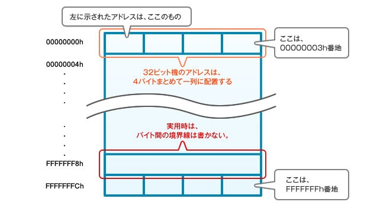
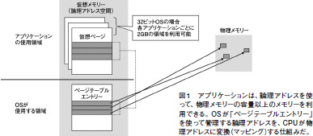
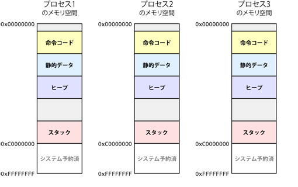

# memory

## CPU

メモリ空間を1byte（8bit）を一つの単位として扱う。
64-bit CPU とは、$2^{64}$ 個のアドレスの個数を扱える。

CPUが直接読み書きできるすべての空間をアドレス空間（メモリ空間）と呼ぶ。アドレス空間は1byte(8bit)ごとに番号が割り振られていて、この番号をアドレスと呼ぶ。
32-bit CPU は$2^{32}$ 個のアドレスを使用でき、64-bit CPU は $2^{64}$ 個のアドレスを使用できる。そのため、32-bit CPU では直接扱うことのできるメモリサイズが約4GByteに限定されていたので、最近は64-bit CPUが主流になっている。

32-bit CPU がどのようにアドレス空間を処理するのかを以下の図に示す。



# 仮想メモリ（論理メモリ）

メモリXXGBというとそれは物理的なメモリサイズ（物理メモリ）について言っていて、実際に使用できるメモリサイズを表している。
プログラムを組む時にどれだけのメモリが使用できるのかどうかをユーザーが考えながら構築するのは非効率である。そこで仮想メモリと呼ばれる手法を用いて実際とは別の仮想的なメモリ空間を割り当てる。ユーザーはその仮想メモリ空間内での振る舞いを考えるだけでよく、実際の物理メモリ上でどう割り当てるかはOSが考えてくれる。





# 

- ヒープ
- スタック

仮想メモリによって、プロセスごとに（仮想的に）異なるメモリ空間を扱うことが出来る。これによってプログラムはどのメモリ空間に配置されるかという問題を意識する必要がない。
プログラムをコンパイルする際に、メモリ空間を次の図のように取り扱う。



メモリの低位（0x00000000）から

- 命令コード（プログラム領域）
- 動的データ
- ヒープ領域
- スタック領域

の領域が割り当てられる。


## プログラム領域

機械語に翻訳されたプログラムが格納される領域。

## ヒープ領域

メモリの動的管理（`new, delete, malloc`）で扱うことができる領域。スタック領域とは異なり、あらかじめ割当容量が決まっているわけではない。
高速で扱う場合にはヒープ領域は好ましくない。


## スタック領域

ローカル変数、関数の引数、戻り値などの一時変数が格納される領域。コンパイルする時点でスタック領域のサイズは固定される。
例えば実行ごとに可変長なデータを扱う際には、最大サイズを先に確保しておく実装も考えられるが、それではメモリの無駄遣いになる。
そのため、ヒープ領域をうまく使うことで無駄遣いの問題を回避する。

これらの変数はすべてスタック領域に保存される。
```cpp
int main() {
   int a;
   int b[10];
   int n = 20;
   int c[n];
}
```

関数が呼び出されれた時に、変数などのデータはスタック領域に保存される。


# ヒープ領域とスタック領域の比較

- メモリサイズはヒープ領域 $>$ スタック領域
- プロセスの実行中に動的にメモリを確保できる（ヒープ領域）
- スタック領域は高速にアクセスできる
	- スタック領域の確保、とはメモリ空間のポインタを確保するサイズ分だけ移動させるだけでよい（事前にサイズを確保しているため）
	- ヒープ領域はOSが管理するためメモリの割当に都度時間がかかるが、スタック領域はコンパイル時にサイズを固定して確保しているので、高速に使用することができる
	- よく使用される変数がメモリに格納されるので、CPUキャッシュに乗りやすくなりアクセスが高速になる傾向がある 
	- ヒープ領域はグローバルな領域であるため、排他制御などによって速度が遅くなる

